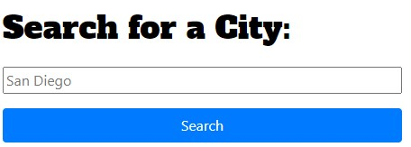

# Weathers-R-Us

## Description
Weather sites are like New York City, they have too many flashing lights and distractions. Look no further! This weather website will give you the current weather for the city of your choosing, without any advertisements! It's as simple as typing in the city you would like to check and clicking "Search". 

I built this project because weather websites have too much extra stuff, it's like they almost forgot about the "meat and potatoes" of searching for weather forecasts.. just the plain old weather! My website is just that; plain old weather.

## Installation
There is no installation necessary, please visit [this website](https://brigantinojoe.github.io/weather_App/) to get started.

## Usage
Please follow the instructions below:
1. Go to [this website](https://brigantinojoe.github.io/weather_App/)
2. Find the search bar on the left side of your screen and enter the city and click "Search". Here's what it will look like:

3. The weather will then populate in the main section of the page. 
4. You can use the "past searches" below the "Search" button to repopulate old searches as seen below:

5. Enjoy the weather out there!
